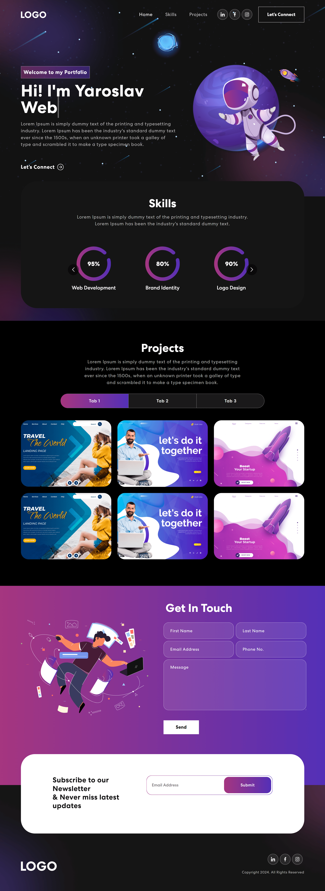

# Проект: Сайт-портфолио на React

[Ссылка на GitHub Pages](https://yaroslav-chertov.github.io//)

## Описание и функциональность

Работа представляет из себя одностраничный адаптивный сайт с расширенной анимацией. Выполнена с помощью React, React-bootstrap и Animate CSS.



Технологии:

* React JS;
* React-bootstrap;
* Animate CSS.

## Инструкция по установке

Клонировать репозиторий:

`
git clone https://github.com/Yaroslav-Chertov/portfolio-website.git
`

В директории проекта запустить приложение в режиме разработки:

```
npm install
npm start
```